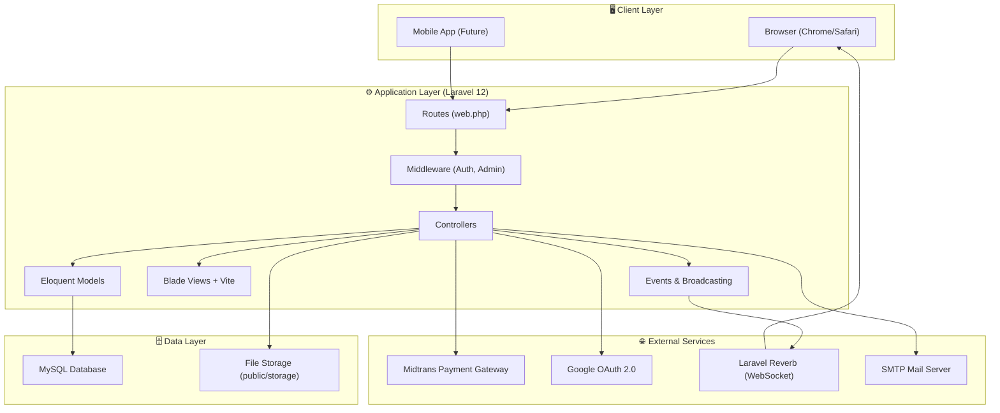
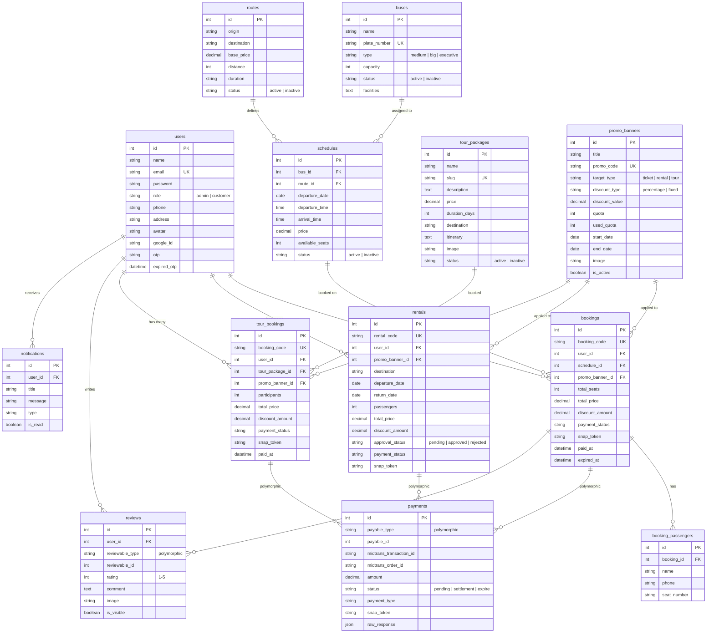
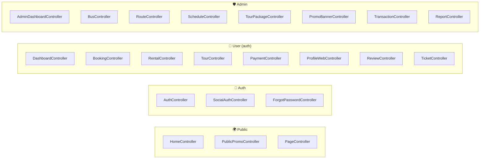
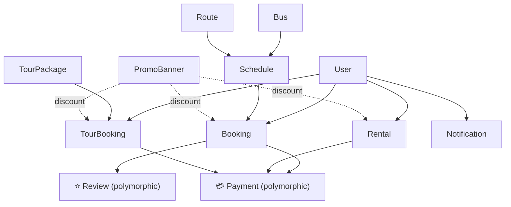
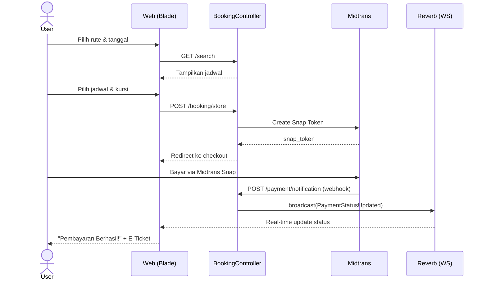
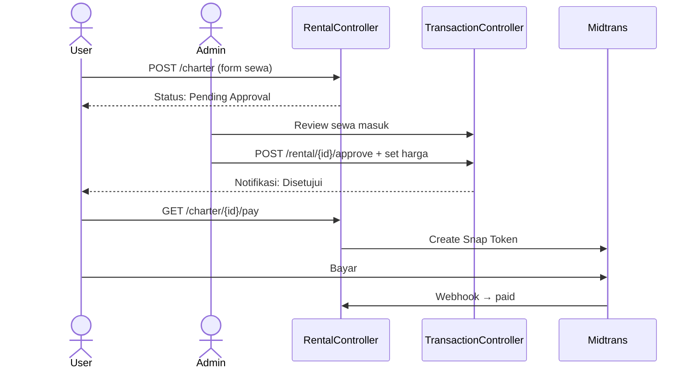
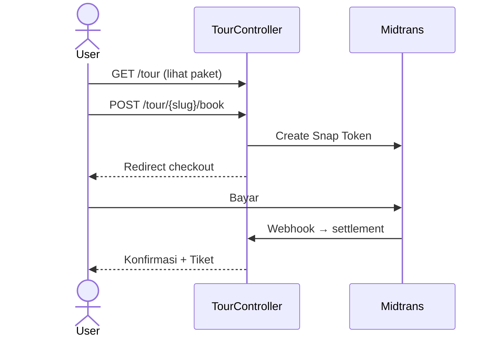
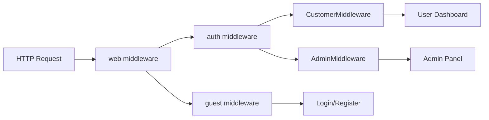
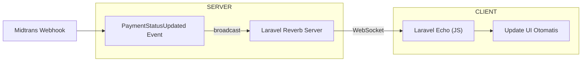

# 🏗️ Arsitektur Sistem — Bus 88

Dokumen ini menjelaskan arsitektur lengkap aplikasi **Bus 88**, sistem pemesanan tiket bus, sewa bus charter, dan paket wisata berbasis web.

---

## 1. Gambaran Umum (High-Level Overview)



---

## 2. Tech Stack

| Layer | Teknologi | Versi |
| :--- | :--- | :--- |
| **Backend** | Laravel (PHP) | 12.x |
| **Frontend** | Blade + Tailwind CSS + Alpine.js | TW 4.x |
| **Build Tool** | Vite | 7.x |
| **Database** | MySQL | 8.x |
| **Payment** | Midtrans Snap API | v2 |
| **Real-time** | Laravel Reverb (WebSocket) | 1.x |
| **Auth** | Laravel Auth + Google OAuth | - |
| **OTP** | Email-based OTP | - |
| **Hosting** | Laragon (Local) | - |

---

## 3. Entity Relationship Diagram (ERD)



---

## 4. Arsitektur MVC (Model-View-Controller)

### Controllers



### Models & Polymorphic Relationships



---

## 5. Alur Bisnis Utama

### A. Booking Tiket Bus



### B. Sewa Bus (Charter)



### C. Booking Paket Wisata



---

## 6. Middleware & Security



| Middleware | File | Fungsi |
| :--- | :--- | :--- |
| `auth` | Laravel built-in | Memastikan user sudah login |
| `guest` | Laravel built-in | Hanya untuk user belum login |
| `AdminMiddleware` | `app/Http/Middleware/AdminMiddleware.php` | Cek `role === 'admin'` |
| `CustomerMiddleware` | `app/Http/Middleware/CustomerMiddleware.php` | Cek `role === 'customer'` |

---

## 7. Real-time Broadcasting



**Channel:** `payment.{payment_id}`
**Event:** `.payment.updated`

---

## 8. Struktur Direktori

```
bus_88/
├── app/
│   ├── Events/                    # PaymentStatusUpdated, TestEvent
│   ├── Http/
│   │   ├── Controllers/
│   │   │   ├── Admin/             # 9 controllers (CRUD admin)
│   │   │   ├── Api/Mobile/        # Future mobile API
│   │   │   ├── Auth/              # AuthController, SocialAuth, ForgotPassword
│   │   │   ├── BookingController  # Booking tiket bus
│   │   │   ├── PaymentController  # Midtrans webhook + finish
│   │   │   ├── RentalController   # Sewa bus charter
│   │   │   ├── TourController     # Paket wisata
│   │   │   └── ...
│   │   └── Middleware/            # AdminMiddleware, CustomerMiddleware
│   ├── Models/                    # 14 Eloquent models
│   └── Providers/
├── database/
│   └── migrations/                # 31 migration files
├── resources/
│   ├── css/app.css                # Design System (palet, komponen, 3D animations)
│   ├── js/app.js                  # Alpine.js + Laravel Echo
│   └── views/
│       ├── admin/                 # Dashboard, CRUD views
│       ├── layouts/               # app.blade.php, admin.blade.php
│       ├── partials/              # navbar, footer
│       └── ...                    # home, schedules, rental, tour, auth, tickets
├── routes/
│   └── web.php                    # ~210 baris, 50+ routes
├── public/
│   ├── build/                     # Vite compiled assets
│   └── images/                    # Static assets
└── config/
    └── broadcasting.php           # Reverb/Pusher config
```

---

## 9. Integrasi Pihak Ketiga

| Service | Kegunaan | Integrasi |
| :--- | :--- | :--- |
| **Midtrans** | Payment Gateway (VA, E-Wallet, CC) | Snap API + Server Notification Webhook |
| **Google OAuth** | Social Login | `SocialAuthController` via Socialite |
| **Laravel Reverb** | Real-time WebSocket | Broadcasting events via Echo |
| **SMTP** | Kirim OTP Reset Password | Laravel Mail |
| **SweetAlert2** | UI Notification/Dialog | CDN script |
| **Swiper.js** | Promo Banner Slider | CDN script |
| **ui-avatars.com** | Generated User Avatars | External API |

---

## 10. Ringkasan Statistik Kode

| Metrik | Jumlah |
| :--- | :--- |
| **Models** | 14 |
| **Controllers** | 24 (12 user + 9 admin + 3 auth) |
| **Migrations** | 31 |
| **Routes** | 50+ endpoints |
| **Blade Views** | 30+ files |
| **Events** | 2 (PaymentStatusUpdated, TestEvent) |
| **Middleware** | 2 custom (Admin, Customer) |

---
*Arsitektur Bus 88 — Dibuat Mei 2026*
